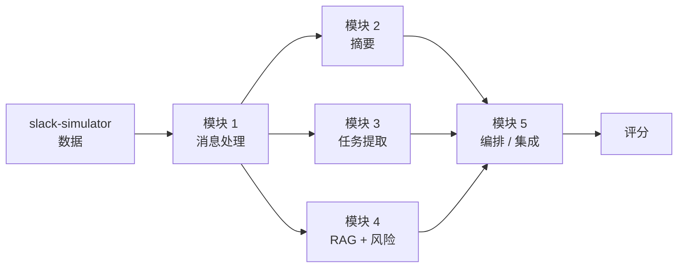

# AI Training — Session 1

第 1 次课：项目全景、环境检查、Hello Bot 与统一 LLM 调用入口。

本次仅发布第 1 课代码及必要共享模块。ARCHITECTURE.md 展示完整课程的架构；其中后续课次的代码尚未包含在本次发布中。

## Quick start

建议使用 Python 3.12。没有 Slack token 时，Hello Bot 使用控制台模式；输入 quit 退出。可选模型 SDK 或密钥显示 MISSING 不影响离线练习。

如需配置本地密钥，复制 `course-demos/.env.example` 为 `course-demos/.env`，再填入自己的 Slack 或 LLM 密钥。不要提交 `.env`。

### GitHub authentication

学生需要先完成 GitHub 认证，才能从私有仓库 clone/pull/push。最常见、也最省心的方法是 GitHub CLI；GitHub 官方也推荐用 GitHub CLI 或 Git Credential Manager 来缓存 HTTPS 凭据。

#### Windows (PowerShell)

推荐方式：安装 Git for Windows 和 GitHub CLI，然后登录：

```powershell
winget install --id Git.Git -e
winget install --id GitHub.cli -e
gh auth login
gh auth setup-git
gh auth status
```

`gh auth login` 过程中选择：

- `GitHub.com`
- `HTTPS`
- `Y`，允许 GitHub CLI 认证 Git 操作
- 按提示在浏览器完成登录

备选方式：只安装最新版 Git for Windows。它自带 Git Credential Manager；第一次 clone/pull/push HTTPS 仓库时，会自动弹出浏览器登录。

#### macOS (Terminal)

推荐方式：用 Homebrew 安装 GitHub CLI，然后登录：

```bash
brew install gh
gh auth login
gh auth setup-git
gh auth status
```

`gh auth login` 过程中选择：

- `GitHub.com`
- `HTTPS`
- `Y`，允许 GitHub CLI 认证 Git 操作
- 按提示在浏览器完成登录

备选方式：使用 Git Credential Manager：

```bash
brew install git
brew install --cask git-credential-manager
```

之后第一次 clone/pull/push HTTPS 仓库时，会通过浏览器完成 GitHub 登录，并把凭据保存在 macOS Keychain。

### Windows (PowerShell)

```powershell
python -m venv .venv
.\.venv\Scripts\Activate.ps1
python -m pip install -r course-demos/requirements.txt
python course-demos/session-01-setup/check_env.py
python course-demos/session-01-setup/hello_bot.py
python -m pytest -q
```

### macOS (Terminal)

```bash
python3 -m venv .venv
source .venv/bin/activate
python -m pip install -r course-demos/requirements.txt
python course-demos/session-01-setup/check_env.py
python course-demos/session-01-setup/hello_bot.py
python -m pytest -q
```

## LLM mock exercise

从 course-demos 目录运行 Python：

```python
from common.llm import call_llm
print(call_llm("You are a helpful assistant.", "Hello", mock="Hello from mock"))
```

未配置模型密钥时，上述调用返回固定结果。真实模型可按需安装 openai 或 anthropic 并在本地配置密钥；不要提交 .env 或密钥。测试会移除模型密钥，使用离线模式。

## Session 1 exercises

### Mermaid module diagram

使用 [mermaid.live](https://mermaid.live/) 绘制 Mermaid 格式的模块图。可以从下面的结构开始：



### Spreadsheet data analysis

使用课程数据表分析个人的 `name` 和 `email` 字段：

[Session 1 Google Sheet](https://docs.google.com/spreadsheets/d/1fztebz0vK9NPx97_qHoxdOPS1MW4t8fEL4XH2D_iS_M/edit?gid=0#gid=0)
