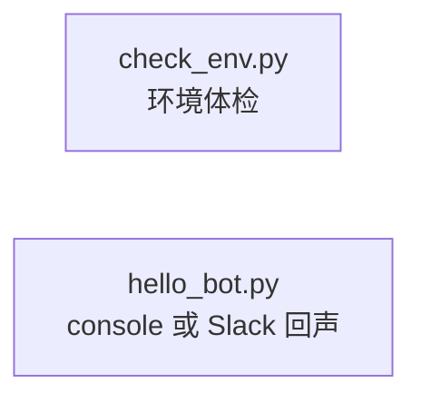

# 项目架构：模块依赖图

第1课作业「阅读脚手架架构文档并画出模块依赖图」的参考答案。

## 第1课看到的部分

`session-01-setup/` 目前是两个独立脚本，还没有用到 `common/` 共享库：

- `check_env.py` 只检查环境变量和已安装的包，不调用任何共享模块。
- `hello_bot.py` 没有 Slack token 时走 console 模式；`common/llm.py` 要到第3课才真正被调用。
- 第1课的"架构"就是两个能独立运行的脚本——用它来练"读架构图"是安全的起点：图很小，不会一上来就把人淹没。

完整课程（14个 session、6大模块）的架构图见 [ARCHITECTURE_FULL.md](ARCHITECTURE_FULL.md)——后续课程逐步解锁对应模块，现在不用通读。
