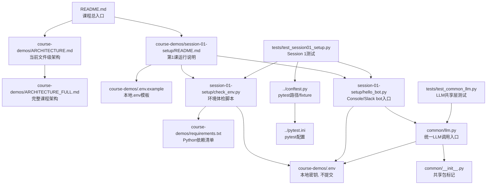
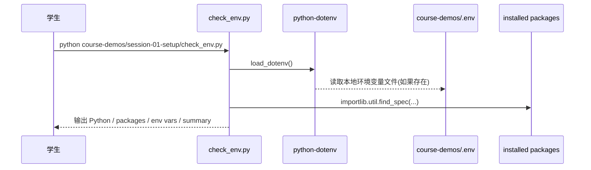
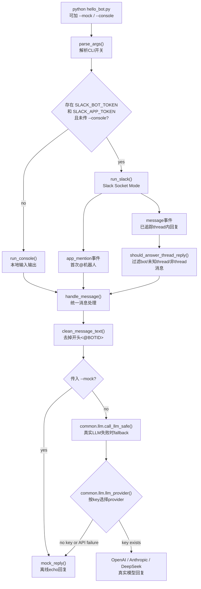
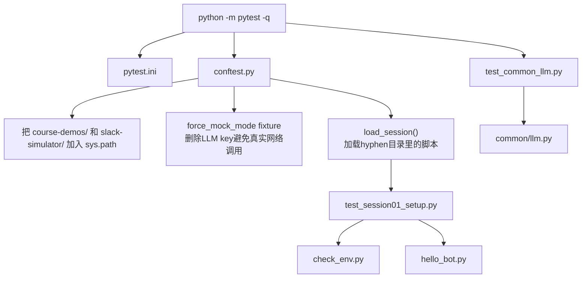
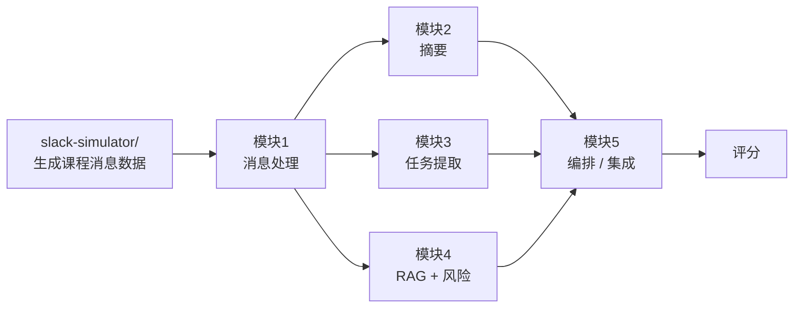

# 项目架构：Session 1 文件级关系

第 1 课作业「阅读脚手架架构文档并画出模块依赖图」的参考答案。本文只解释当前已发布代码的文件级关系；完整课程（14 个 session、6 大模块）的长期架构见 [ARCHITECTURE_FULL.md](ARCHITECTURE_FULL.md)。

## 文件树

```text
.
├── README.md
├── pytest.ini
├── conftest.py
├── course-demos/
│   ├── .env.example
│   ├── ARCHITECTURE.md
│   ├── ARCHITECTURE_FULL.md
│   ├── requirements.txt
│   ├── assets/
│   │   └── session-01-module-flow.png
│   ├── common/
│   │   ├── __init__.py
│   │   └── llm.py
│   ├── session-01-setup/
│   │   ├── README.md
│   │   ├── check_env.py
│   │   └── hello_bot.py
│   └── tests/
│       ├── test_common_llm.py
│       └── test_session01_setup.py
└── slack-simulator/
    ├── README.md
    ├── generate_messages.py
    ├── inject_slack.py
    ├── config/
    ├── data/
    ├── kb/
    └── tests/
```

`course-demos/venv/`、`.venv/`、`.pytest_cache/`、`course-demos/.env` 是本地运行产生或保存密钥的文件，不属于架构，也不应该提交。

## Session 1 文件依赖图



## 运行链路 1：环境检查



`check_env.py` 不调用 LLM，也不连接 Slack。它只回答三个问题：

- 当前 Python 版本是否满足 `>= 3.9`
- `yaml`、`flask`、`slack_sdk` 等依赖是否安装
- Slack/LLM 相关环境变量是否存在

## 运行链路 2：Hello Bot



`hello_bot.py` 的核心设计是把「消息从哪里来」和「如何生成回复」分开：

- `run_console()` 负责本地终端输入输出，方便没有 Slack token 时练习。
- `run_slack()` 负责 Slack Socket Mode 连接和事件监听。
- `handle_message()` 是共享的 bot brain；Console 和 Slack 都调用它。
- `--mock` 强制跳过真实 LLM，直接走离线 echo 回复。
- 没有 `--mock` 时，`handle_message()` 调用 `common.llm.call_llm_safe()`，有模型密钥就请求真实 LLM；没有密钥或 API 失败就 fallback 到 `mock_reply()`。
- Slack 中第一次 `@mention` 会记录 thread；同一 thread 后续人类消息不需要再次 `@mention`，也会进入 `handle_message()`。

## 共享 LLM 层

```mermaid
flowchart LR
    caller["调用方<br/>hello_bot.py 或后续session"] --> call["call_llm_safe() / call_llm()"]
    call --> provider["llm_provider()"]
    provider --> openai{"OPENAI_API_KEY?"}
    provider --> anthropic{"ANTHROPIC_API_KEY?"}
    provider --> deepseek{"DEEPSEEK_API_KEY?"}
    openai --> openai_sdk["openai SDK"]
    anthropic --> anthropic_sdk["anthropic SDK"]
    deepseek --> deepseek_sdk["OpenAI-compatible DeepSeek API"]
    call --> mock["mock fallback"]
```

`common/llm.py` 是后续课程会持续复用的统一入口。它的职责不是业务逻辑，而是把 provider 选择、模型名、timeout、retry、mock fallback 收到一个地方，避免每个 session 都重复写一份「如果有 OPENAI_API_KEY 就调 OpenAI，否则调 mock」。

环境变量加载顺序：

- 先调用 `load_dotenv()`，允许从当前运行目录附近读取 `.env`
- 再显式加载 `course-demos/.env`
- 第二次加载不会覆盖已经存在的环境变量

## 测试关系



测试层有两个重要约束：

- `conftest.py` 会删除 `OPENAI_API_KEY`、`ANTHROPIC_API_KEY`、`DEEPSEEK_API_KEY`，保证测试不会误调真实模型。
- `load_session()` 用文件路径加载 `session-01-setup/hello_bot.py` 这类带连字符目录下的脚本，因为它们不能直接用普通 Python package import。

## 与 slack-simulator 的关系

Session 1 的 `hello_bot.py` 直接连接真实 Slack 或本地 console，不直接读取 `slack-simulator/`。`slack-simulator/` 是课程数据侧的输入系统，后续模块会围绕它生成、注入和评估 Slack 风格消息。



当前仓库里已经能看到 `slack-simulator/` 的数据、配置和测试文件，但 Session 1 的代码目标仍然是把环境、凭据、Slack 连接、LLM 调用入口跑通。

## 每个文件的职责

| 文件 | 职责 | 被谁使用 |
| --- | --- | --- |
| `README.md` | 课程总入口、通用准备、GitHub auth、session 列表 | 学生/老师 |
| `course-demos/session-01-setup/README.md` | Session 1 的具体运行步骤和课堂练习 | 学生/老师 |
| `course-demos/ARCHITECTURE.md` | 当前已发布代码的文件级架构说明 | 学生/老师 |
| `course-demos/ARCHITECTURE_FULL.md` | 完整课程未来架构 | 学生/老师 |
| `course-demos/requirements.txt` | demo 运行和测试所需 Python 包 | `pip install -r ...` |
| `course-demos/.env.example` | `.env` 模板，不含真实密钥 | 学生复制为 `.env` |
| `course-demos/.env` | 本地真实密钥和配置，不提交 | `python-dotenv` 读取 |
| `course-demos/common/llm.py` | 统一 LLM 调用、provider 选择、mock fallback | `hello_bot.py`、后续 session、测试 |
| `course-demos/common/__init__.py` | 标记 `common` 为共享包 | Python import 系统 |
| `course-demos/session-01-setup/check_env.py` | 检查 Python、依赖和环境变量 | 学生运行、测试 |
| `course-demos/session-01-setup/hello_bot.py` | Console/Slack bot，线程回复，LLM 或 mock 响应 | 学生运行、测试 |
| `course-demos/tests/test_session01_setup.py` | Session 1 行为测试 | pytest |
| `course-demos/tests/test_common_llm.py` | LLM 共享层 mock/可用性测试 | pytest |
| `conftest.py` | pytest 路径、mock 环境、脚本加载工具 | pytest |
| `pytest.ini` | pytest 配置 | pytest |
| `course-demos/assets/session-01-module-flow.png` | 课程模块流程图图片 | 文档/课堂展示 |
| `slack-simulator/` | 课程 Slack 数据生成、注入、知识库和测试 | 后续模块 |
