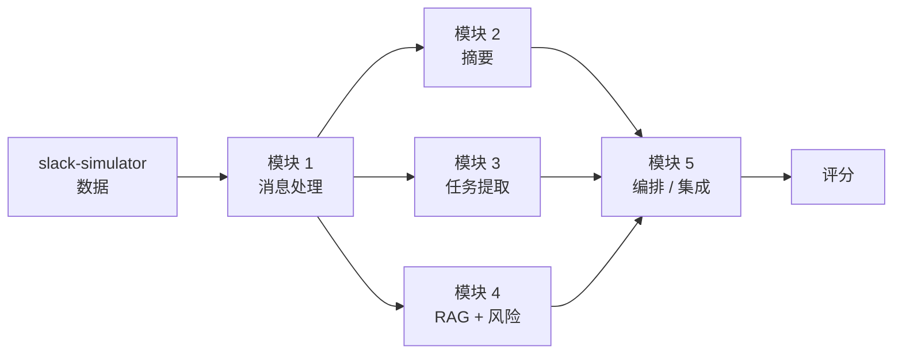

# 第1课 · 环境搭建

**演示要点**：企业级项目从环境自检开始——依赖、密钥、连通性都应可一键验证，而不是"在我机器上能跑"。

```bash
python check_env.py            # 环境自检，输出每项 OK / MISSING
python hello_bot.py            # 无Slack token时进入控制台模式
python hello_bot.py --mock     # Slack/console 都强制使用离线 echo 回复，不调用真实 LLM
python hello_bot.py --console --mock  # 即使已配置Slack token，也在本地控制台测试mock回复
```

有真实 Slack token 时（`SLACK_BOT_TOKEN` + `SLACK_APP_TOKEN`，App 需开启 Socket Mode），`hello_bot.py` 会连上 workspace 响应 @mention。被 @mention 后，同一 thread 里的后续消息不需要再次 @mention，bot 会继续回复。配置 `OPENAI_API_KEY` 或 `DEEPSEEK_API_KEY` 时，回复由 LLM 生成；没有模型密钥或传入 `--mock` 时自动回到离线 echo 模式。

## 课堂练习

### Mermaid 模块图

使用 [mermaid.live](https://mermaid.live/) 绘制 Mermaid 格式的模块图：



### 表格数据分析

使用课程数据表分析个人的 `name` 和 `email` 字段：

[Session 1 Google Sheet](https://docs.google.com/spreadsheets/d/1fztebz0vK9NPx97_qHoxdOPS1MW4t8fEL4XH2D_iS_M/edit?gid=0#gid=0)
