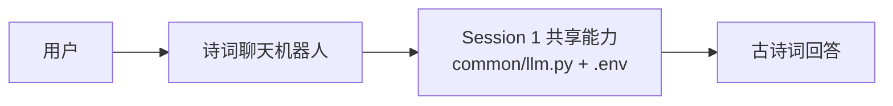

# Session 1 练习：诗词聊天机器人

## 背景

创建一个聊天机器人。对于用户的每一句输入，程序先调用 LLM 理解用户含义，再输出一句合适的古诗词作为回答。

## 练习一：用 Mermaid 设计架构

目标：先用架构图设计程序，不急着写代码。

要求：

- 使用 [mermaid.live](https://mermaid.live/) 绘制 Mermaid 格式的架构图。
- 机器人接收用户输入，并返回一句合适的古诗词。
- 必须复用 Session 1 已有的 LLM 接口和配置，不能另外创建一套。
- 图中只画系统组件及其依赖关系，不展开 Prompt、模型选择、函数调用或错误处理。

可以从下面的 Mermaid 图开始，再根据自己的理解调整：



设计提示：

- `course-demos/common/llm.py` 和 `course-demos/.env` 都属于图中的“Session 1 共享 LLM 能力”。
- 重点说明组件边界和依赖方向，实现细节留到练习二。

## 练习二：由架构图生成程序

使用练习一的 Mermaid 图作为输入，让 Codex/Claude 生成 Python 程序；再让生成的程序输出一张 Mermaid 图，用来和原始设计图对比。

本仓库提供一个参考实现。请先按照 [Session 1 Quick start](../README.md#quick-start)
创建 `.venv` 并安装依赖。在仓库根目录 `~/student` 激活虚拟环境，然后进入练习目录运行。

macOS (Terminal)：

```bash
source .venv/bin/activate
cd course-demos/session-01-setup/practices

python session_01_poem_bot.py --mock --once "我今天很想家"
python session_01_poem_bot.py --diagram
python session_01_poem_bot.py --mock
```

Windows (PowerShell)：

```powershell
.\.venv\Scripts\Activate.ps1
Set-Location course-demos/session-01-setup/practices

python session_01_poem_bot.py --mock --once "我今天很想家"
python session_01_poem_bot.py --diagram
python session_01_poem_bot.py --mock
```

运行方式：

- `--mock`：强制使用离线固定规则，不调用真实 LLM。
- `--once "..."`：只回答一句输入，适合快速测试。
- `--diagram`：输出这个程序实际实现的 Mermaid 架构图，用来和练习一的设计图对比。

程序要求：

- 使用 `course-demos/common/llm.py` 的 `call_llm_safe()`。
- 使用 `course-demos/.env` 读取模型密钥。
- 没有模型密钥或 API 失败时，自动 fallback 到 mock 诗句回复。
- 对用户每一句输入，输出一句古诗词，并附一句很短的说明。
