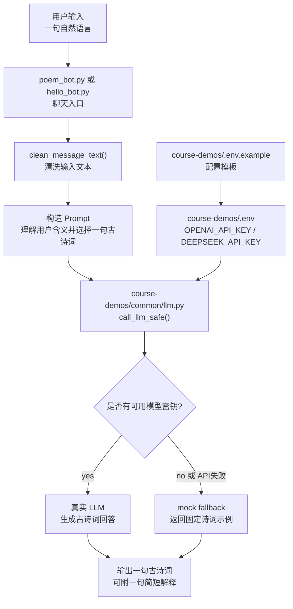

# Session 1 练习：诗词聊天机器人

## 背景

创建一个聊天机器人。对于用户的每一句输入，程序先调用 LLM 理解用户含义，再输出一句合适的古诗词作为回答。

## 练习一：用 Mermaid 设计架构

目标：先用架构图设计程序，不急着写代码。

要求：

- 使用 [mermaid.live](https://mermaid.live/) 绘制 Mermaid 格式的架构图。
- 必须基于 Session 1 已有文件和配置来设计，不要引入新的 LLM 调用入口。
- 必须使用 `course-demos/common/llm.py` 与 LLM 交互。
- 必须使用 `course-demos/.env` 或环境变量读取模型密钥。
- 必须保留 mock/offline 路径，方便没有模型密钥时也能运行。
- 图里要体现用户输入、消息清洗、Prompt 构造、LLM 调用、诗词回答、错误 fallback。

可以从下面的 Mermaid 图开始，再根据自己的理解调整：

设计提示：

- `common/llm.py` 已经封装 provider 选择和 fallback，不要在新程序里重复写一套 OpenAI/DeepSeek 判断。
- `.env.example` 只放变量名，不放真实密钥；真实密钥只写在本地 `.env`。
- mock 路径应该稳定、可预测，便于课堂演示和测试。
- 输出重点是一句古诗词；解释可以很短，不要变成长篇作文。

## 练习二：由架构图生成程序

下一步会使用练习一的 Mermaid 图作为输入，让 Codex/Claude 生成 Python 程序；再让生成的程序输出一张 Mermaid 图，用来和原始设计图对比。
