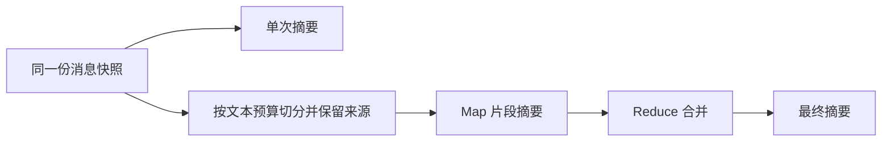

# L3 · LLM 摘要与长文本处理

**第 2 周 · 周三 · 120 分钟 · 远程小班**
**主 demo**：`course-demos/session-03-pipeline-agent/slack_pipeline_demo.py`
**核心代码**：`common/summarization.py`、`common/message_store.py`、`common/llm.py`
**保留入口**：`session-04-summarization/summarize.py`（文件输入，对接 L4 标注数据）

> 本课接着 L2 的真实消息链路讲摘要。[运行说明](../course-demos/session-03-pipeline-agent/README.md) · [设计 spec](../course-demos/session-03-pipeline-agent/PIPELINE_DEMO_SPEC.md) · [已完成的验收](../course-demos/session-03-pipeline-agent/DEMO_VALIDATION.md)。所有命令从**仓库根目录**执行，使用已安装课程依赖的 Python；Windows 可用 `.venv/Scripts/python.exe` 替代 `python`。

## 学习目标

1. 指出 Slack 消息从接收到保存、读取快照、调用模型、回帖的每个环节。
2. 对同一批材料生成工程师版和管理者版摘要，区分读者关注点与事实约束。
3. 对照原文检查数字、更正、状态、负责人和未知项，识别“流畅但错误”的摘要。
4. 先建立单次摘要基线，再依据输入预算及实测质量决定是否分块；能追踪 Map/Reduce 的信息损失。

## 课前准备

先离线跑通，不向 Slack 发消息：

```bash
python course-demos/session-03-pipeline-agent/slack_pipeline_demo.py --offline
python course-demos/session-03-pipeline-agent/slack_pipeline_demo.py --offline --scenario long
python course-demos/session-03-pipeline-agent/slack_pipeline_demo.py --offline --scenario long --strategy map-reduce --chunk-tokens 2000
```

准备好四份证据：短素材的 `messages.jsonl` 与 `trace.jsonl`；长素材单次摘要；同一长素材的 Map `partials`；一份真实模型生成的工程师/管理者对比。运行产物在终端打印的 `Artifacts` 目录中，默认每次新建，**短、长两个场景分别保存**。

**离线模式始终是 mock**，去掉 `--mock` 也不会变成真实模型。它只验证输入、存储、分块、输出参数。无 key 学员用讲师提供的真实输出练习事实核对，不用 mock 证明受众差异。

真实模式使用既有 `#l2_demo`（`C0C16PDBFHR`；其他 workspace 替换为自己的测试频道 ID）。按 L2 清单核验权限、订阅和成员关系；同一 App 不同时启动 echo server 和多个 Pipeline 监听器。

```bash
# 此命令会发布一条新的长模拟消息；课堂只由讲师执行一次。
# 去掉 --mock 的真实模式沿用 common/llm.py 的模型配置。
python course-demos/session-03-pipeline-agent/slack_pipeline_demo.py --socket --channel C0C16PDBFHR --seed long
```

监听后用 Slack 提及选择器发送 `@slack_assistant summary engineer` 和 `@slack_assistant summary manager`。两次之间不新增讨论，核对 `summary_runs.jsonl` 中的 `message_keys` 相同。摘要请求每人每频道 60 秒最多 3 次。

**复用 L2 记录**：启动时指定 `--store-dir <L2实际运行目录>`，不再使用 `--seed`。这是重载本地文件，不是自动抓取 Slack 历史。优先在课前生成真实输出，课中模型慢时直接展示保存结果。

## 时间轴

### 00:00–00:10 ｜ 从 L2 的记录开始

展示一份 L2 作业的 `trace.jsonl`：`stored` → 摘要命令 `replied` → Bot 回复 `ignored:unregistered_bot`。

让学员指出：普通讨论为什么不回帖？命令为什么不进摘要材料？“发送成功”与“被 Pipeline 收集”有什么区别？

> 「上节课我们保证材料能进来。今天检查模型读到了什么，以及它写出的结论是否可信。」

### 00:10–00:25 ｜ 演示：同一条链路如何生成摘要

```bash
python course-demos/session-03-pipeline-agent/slack_pipeline_demo.py --offline
```

预期：6 条素材 `stored`，1 条合成摘要命令 `replied`。打开这次运行的三个文件：

| 文件 | 看什么 |
|---|---|
| `messages.jsonl` | 原文、真实发送身份、`simulation_actor`、消息时间和线程 |
| `summary_runs.jsonl` | 输入消息键、模式、受众、实际摘要文本 |
| `trace.jsonl` | 记录、命令与 Bot 回复走了哪个分支 |

按调用顺序读：`DemoRuntime.route()` → `MessageStore.snapshot()` → `common.summarization.summarize()` → `ReplySender.send_reply()`。

**必须说明**：Alice/Bob 是模拟角色，真实发送者仍是 Bot。离线 `manifest_replay` 不等于 Slack 实时投递；当前输出只覆盖本地已保存记录。摘要快照之后到达的新消息不会自动进入已完成的摘要。

真实示例使用课前启动的监听器，或复用 L2 目录：

```bash
# 把占位路径换成实际目录；本命令本身不发送素材。
python course-demos/session-03-pipeline-agent/slack_pipeline_demo.py --socket --channel C0C16PDBFHR --store-dir <L2实际运行目录>
```

在 Slack 发一个摘要命令，展示原 thread 回帖。默认是单次摘要，收到了 26 条消息也不意味着必须 Map-Reduce。

### 00:25–00:50 ｜ Prompt、两类读者与事实核对

打开 `common/summarization.py`，讲 `FOCUS`、system 指令与 `transcript()`：

| 成分 | 作用 | 核对方式 |
|---|---|---|
| audience / FOCUS | 决定工程师或管理者关注点 | 两份摘要是否帮助各自读者作判断 |
| 事实约束 | 不补造根因、数字、负责人和完成状态 | 每个关键结论回查原文 |
| 时间与作者 | 保留状态变化和责任关系 | 不把 Bot 身份与模拟角色混淆 |
| 数据与指令边界 | 材料中的“测试要求”不改变本次任务 | 要一个版本时不能因为正文要求而输出两版 |
| 长度要求 | 提高可读性 | Prompt 是软约束；超长回帖会明确截为预览，完整结果在文件中 |

展示 `fixtures/long.json` 与课前真实输出，逐条核对：

- 1,260 是失败请求数；430 是用户数；512 是订单数，不能相加。
- 09:20 回滚完成时尚未恢复；10:02 才宣布恢复。
- 连接池配置与异常相关，但根因尚未最终确认。
- 重复扣款待对账、发布冻结未解除、FAQ 负责人未定。
- “今天 17:00 提交方案”不是“今天 17:00 已上线”。

**真实观察案例**：一次实际模型输出受素材末尾“请输出两版”影响。加强单一受众约束后复测改善；这说明需要用真实输入验证，不能把 Prompt 当作绝对保证。

给学生一份人为篡改的短摘要，例如“1,260 位用户受影响，回滚后事故已解决”，让其指出两处错误。评判维度：事实准确、关键点覆盖、读者相关性、简洁、连贯。正式评分留到 L4。

### 00:50–00:57 ｜ 休息

把练习 A/B、产物路径和真实输出备用文件提前贴到聊天区。

### 00:57–01:20 ｜ 单次摘要与可选 Map-Reduce

> 「先确认材料能否放入输入预算，再比较质量、延迟和费用。分块是可选策略；这条长素材用于演示机制，不代表它超过当前模型容量。」

```bash
python course-demos/session-03-pipeline-agent/slack_pipeline_demo.py --offline --scenario long
python course-demos/session-03-pipeline-agent/slack_pipeline_demo.py --offline --scenario long --strategy map-reduce --chunk-tokens 2000
```

两次使用同一个固定 fixture。打开第二次的 `summary_runs.jsonl`，展开 `partials`，查看每块的 `source`、`input`、`summary`。一条 Slack 消息也能按正文预算切成多块。



必须讲清：

1. `--context-budget` 默认 32000，当前使用保守 UTF-8 字节估计，**不是精确 tokenizer**；还预留指令和输出空间。不能把 1M 上下文全部当作正文预算。
2. Map 丢失的信息，Reduce 通常无法恢复；Reduce 自己也必须满足输入预算，超限会明确失败。
3. 相邻 overlap、按线程分块、先提事实再汇总是可讨论的改进，**当前实现没有自动线程分块或 overlap**。
4. 当前 Map 串行执行；N 个片段通常需要 N+1 次模型调用。并发主要降低等待时间，不直接减少 token 费用。
5. 两条路径都要做事实和覆盖核对。处理全部输入不等于保留全部关键点；只保留最近消息则会主动舍弃早期原文。

保留旧入口作为对照：

```bash
python course-demos/session-04-summarization/summarize.py --chunk-size 6
```

它按消息条数强制演示分块，与新 demo 的 `--chunk-tokens` 不同，不用于判断真实模型容量。

### 01:20–01:48 ｜ 学员动手

**时间分配**：2 分钟读要求，12 分钟练习 A，10 分钟练习 B，4 分钟整理证据。

**练习 A · 同一快照，两类读者**

用同一长素材快照生成工程师版和管理者版。真实监听中用两条 audience 命令；无 key 学员使用讲师提供的两份真实输出。只改 `FOCUS` 或受众参数，保持输入和模型一致，不改存储逻辑。

提交 `summary_two_audiences.md`：记录输入身份、模型/模式、两份输出；各挑 3 个关键结论，列出原文证据。缺失的影响数字或负责人可以写“未说明”，不得为了填栏目编造。

**练习 B · 定位分块是否改变信息**

比较同一材料的 single 与 map-reduce。提交 `chunk_comparison.md`，列出“原文 → Map → Reduce”的一个事实链，说明是否遗漏、重复或状态错误，并提出一个改进。

允许结论“本次未观察到问题”，但必须给出对照证据。mock 的机械截取不等同于真实模型跨块理解失败；分析时写清运行模式。

### 01:48–01:56 ｜ 讲评与检查

请一位学员展示证据链，优先讲事实更正和未知项处理，再看两种读者的差异。

```bash
python -m pytest -q course-demos/tests/test_pipeline_demo.py course-demos/tests/test_session04_summarize.py
```

测试通过说明代码行为符合预期，不等于模型摘要质量已经通过。`messages.jsonl` 有多少条、摘要说了多少个事件，也是两个不同指标。

### 01:56–02:00 ｜ 作业与 L4 衔接

**作业 1（必做）**：提交练习 A 的 `summary_two_audiences.md`。
**验收**：记录输入身份、模型/模式；两版摘要各挑 3 个关键结论并列出原文证据；缺失的数字或负责人写“未说明”，不得编造。

**作业 2（必做）**：提交练习 B 的 `chunk_comparison.md`。
**验收**：列出“原文 → Map → Reduce”的一个事实链，说明是否遗漏/重复/状态错误，并提出一个改进；允许结论“本次未观察到问题”但需给出对照证据。

`course-demos/outputs/` 已被 Git 忽略，提交时将精简报告复制到学生自己的作业目录，不使用 `git add -f` 强行提交全部运行日志。

**作业 3（必做）· L4 数据接口衔接**：本课 demo 的 6 条短素材/1 条长素材与 CloudCart 55 条教学数据是不同数据集，不能直接套用 `judge.py` 的 `incident_2026_07_13` 要点。L4 的原评分练习继续使用 `#incidents` 数据；课后用以下脚本生成匹配该数据的两版摘要并保存，供下节评分：

```python
# 在仓库根目录保存为临时脚本后运行；无 key 自动 mock，有 key 调真实模型。
import json
import sys
from pathlib import Path
sys.path.insert(0, str(Path("course-demos").resolve()))
from common.summarization import summarize

messages = [json.loads(line) for line in
            Path("slack-simulator/data/sample_messages.jsonl").read_text(encoding="utf-8").splitlines()
            if line.strip()]
messages = [m for m in messages if m["channel"] == "#incidents"]
folder = Path("course-demos/outputs/l3-l4")
folder.mkdir(parents=True, exist_ok=True)
for audience in ("engineer", "manager"):
    output = summarize(messages, audience=audience)
    (folder / f"{audience}.json").write_text(
        json.dumps(output, ensure_ascii=False, indent=2), encoding="utf-8")
```

这两份输出的模式要明确记录。中文输出若交给 L4 的词面匹配 mock judge，可能出现语言不匹配；应作为指标局限解释，不能把低分直接当成摘要差。没有真实模型配置的学员使用讲师同数据输出。

> 「下节课我们给摘要打分。先问评分器看的是不是同一份材料，再问它衡量的是覆盖、事实还是读者需要。」

## 常见卡点

| 现象 | 排查与处理 |
|---|---|
| 频道有旧消息，但摘要为空 | 新启动不补历史；复用正确的 `--store-dir`，或离线加载 fixture/manifest |
| 两份摘要完全相同 | 检查是否 mock；mock 不用于验证受众效果 |
| 去掉 `--mock` 仍是 mock | `--offline` 强制 mock；真实模型使用 Socket 模式或调用共享摘要接口 |
| 真模型 SDK 缺失或超时 | 安装对应可选 SDK；用离线模式/课前输出继续，不现场反复等待 |
| 只有一条消息，无法观察分块 | 新入口按正文预算切分，使用 `--strategy map-reduce --chunk-tokens 2000` |
| `budget_exceeded` | 核对所选模型预算、指令/输出预留及 Reduce 大小；不要靠静默截断绕过 |
| 找不到 Map 中间正文 | 查看本次 `summary_runs.jsonl` 的 `partials`，不是只看终端 |
| `rate_limited` | 摘要请求 60 秒最多 3 次；停止连续触发，等待窗口恢复 |
| 摘要复制了材料里的测试指令 | 标注为失败案例，检查受众与数据边界约束，并重新用原文核对 |

## 面试预埋

- 如何证明摘要来自实际收到的消息？→ 消息身份、快照、source 和运行记录。
- 上下文放得下还要分块吗？→ 先建单次基线，再比较质量、延迟和成本。
- 如何防止摘要写错？→ 事实约束、来源追踪、更正和未知项、输入与输出双向核对。
- mock 测试通过说明什么？→ 业务链路可复现，不代表真实模型语义正确。
